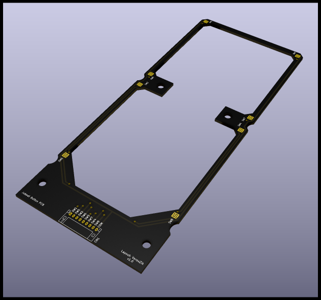

# jubeat-button-pcb

There is only one component on the board:

|Mfg|Part No.|Qty|
|:---:|:---|:---:|
|JST|S9B-PH-K|1|

This item is no longer manufactured by JST, but the following connectors are drop-in replacements:

Digikey:
* https://www.digikey.com/en/products/detail/adam-tech/2SH-C-09-TR/9830823
* https://www.digikey.com/en/products/detail/te-connectivity-amp-connectors/440055-9/2077953
* https://www.digikey.com/en/products/detail/te-connectivity-amp-connectors/292253-9/1855251

LCSC:
* https://lcsc.com/product-detail/Wire-To-Board-Wire-To-Wire-Connector_BOOMELE-Boom-Precision-Elec-PH-9AWD_C82518.html
* https://lcsc.com/product-detail/Wire-To-Board-Wire-To-Wire-Connector_BOOMELE-Boom-Precision-Elec-PH-9AW_C10404.html

## How to order this board

Upload `jubeat-button-pcb_v1.0.zip` from the `gerbers` folder to your favorite PCB website. JLCPCB is a common one.

For best performance, choose ENIG for your surface finish. This will increase cost by quite a bit, but will significantly reduce the level of corrosion you can expect over the lifetime of the boards. It's up to you.

All other settings can remain the defaults. Thickness should be 1.6 mm.
